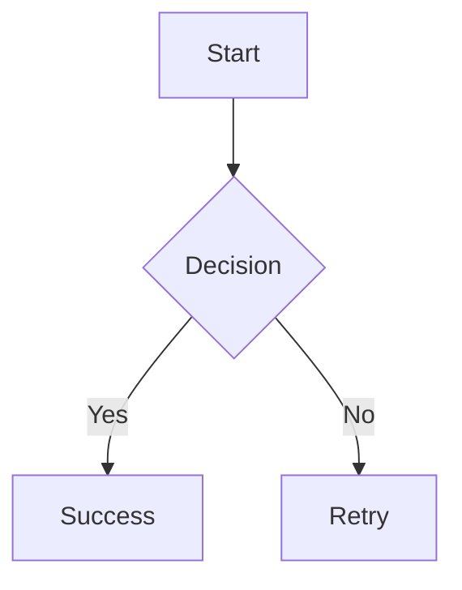

# Claude Memory - Astro Mermaid Integration

## Project Overview
Created a complete astro-mermaid integration for rendering Mermaid diagrams in Astro projects with automatic theme switching and client-side rendering.

## Project Structure
```
/Users/josesebastian/git/astro-mermaid/
├── astro-mermaid-integration.js     # Main integration file (ENHANCED)
├── astro-mermaid-integration.d.ts   # TypeScript definitions
├── package.json                     # Package configuration
├── README.md                        # Documentation
├── .npmrc                          # NPM authentication
├── .gitignore                      # Git ignore rules
├── starlight-demo/                 # Working demo with Starlight
│   ├── package.json
│   ├── astro.config.mjs
│   ├── tsconfig.json
│   └── src/
│       ├── content/
│       │   ├── config.ts
│       │   └── docs/
│       │       ├── index.mdx
│       │       ├── installation.md
│       │       ├── configuration.md
│       │       ├── test-icons.md     # Icon pack test page
│       │       └── examples/
│       │           ├── flowcharts.md
│       │           ├── sequence.md
│       │           ├── gantt.md
│       │           ├── class.md     # Fixed multiplicity syntax
│       │           └── [other diagrams...]
│       ├── styles/
│       │   └── custom.css
│       └── env.d.ts
└── astro-demo/                     # NEW: Professional standalone demo
    ├── README.md                   # Complete setup guide
    ├── package.json               # Minimal dependencies
    ├── astro.config.mjs           # Universal configuration
    ├── tsconfig.json
    └── src/
        ├── content/
        │   ├── config.ts
        │   └── docs/               # All diagram examples
        │       ├── installation.md
        │       ├── configuration.md
        │       ├── test-icons.md
        │       └── [all diagram types...]
        ├── layouts/
        │   └── Layout.astro       # Self-contained professional layout
        └── pages/
            ├── index.astro        # Feature showcase page
            ├── test.astro         # Direct .astro usage demo
            └── docs/
                └── [...slug].astro # Content collection router
```

## Key Technical Implementation

### Integration Features
- **Dual Plugin System**: Both remark + rehype plugins for universal markdown processing
- **Universal Theme Detection**: Supports both `html[data-theme]` and `body[data-theme]` attributes
- **Client-side rendering**: Dynamic mermaid.js loading with performance optimization
- **Automatic theme switching**: Real-time diagram re-rendering on theme changes
- **Built-in responsive CSS**: Comprehensive styling with loading states and animations
- **TypeScript support**: Full type definitions and intellisense
- **Icon pack support**: Custom icons for architecture diagrams via iconify
- **Content Collection Support**: Works seamlessly with Astro content collections

### Critical Setup Order
**IMPORTANT**: The mermaid integration MUST be placed BEFORE Starlight in the integrations array for the rehype plugin to work correctly:

```js
// astro.config.mjs
export default defineConfig({
  integrations: [
    mermaid({
      theme: "forest",
      autoTheme: true,
      mermaidConfig: {
        flowchart: { curve: "basis" }
      }
    }),
    starlight({ /* config */ })  // AFTER mermaid
  ]
});
```

### Configuration Options
```js
mermaid({
  theme: 'forest',              // 'default', 'dark', 'forest', 'neutral', 'base'
  autoTheme: true,              // Enable automatic theme switching
  mermaidConfig: {              // Additional mermaid configuration
    flowchart: { curve: 'basis' },
    startOnLoad: false
  },
  iconPacks: [                  // Register icon packs for use in diagrams
    {
      name: 'logos',
      loader: () => fetch('https://unpkg.com/@iconify-json/logos@1/icons.json').then(res => res.json())
    },
    {
      name: 'iconoir',
      loader: () => fetch('https://unpkg.com/@iconify-json/iconoir@1/icons.json').then(res => res.json())
    }
  ]
})
```

### Built-in CSS Features
The integration includes comprehensive CSS out of the box:
- Responsive SVG sizing with max-width: 100%
- Flexbox centering with proper spacing (margin: 2rem 0)
- Smooth opacity transitions to prevent flash of unstyled content
- Theme-aware subtle backgrounds for light/dark modes
- Horizontal scrolling for large diagrams
- Rounded corners and padding for better visual presentation

### Client-Side Rendering Logic
- Detects data-theme changes for automatic theme switching
- Processes diagrams on DOM ready and after Astro view transitions
- Stores original diagram content in data-diagram attribute
- Generates unique IDs for each diagram (mermaid-{random})
- Includes comprehensive console logging for debugging

## NPM Package Details
- **Package Name**: astro-mermaid
- **Author**: Jose Sebastian
- **NPM Account**: joesaby
- **Repository**: https://github.com/joesaby/astro-mermaid
- **Auth Token**: Configured in .npmrc (not committed to version control)

### Dependencies
- **Peer Dependencies**: astro ^4.0.0 || ^5.0.0, mermaid ^10.0.0 || ^11.0.0
- **Runtime Dependencies**: mdast-util-to-string ^4.0.0, unist-util-visit ^5.0.0
- **Dev Dependencies**: TypeScript, Astro, Mermaid for development

## Usage Example
After installation with `npm install astro-mermaid mermaid`:

```js
// astro.config.mjs
import mermaid from 'astro-mermaid';
export default defineConfig({
  integrations: [mermaid()]
});
```

Then in markdown files:
````markdown

````

## Working Demo
- Successfully running at http://localhost:4321 in starlight-demo
- All mermaid diagrams render correctly including architecture-beta diagrams with icon packs
- Theme switching works automatically
- Integrates seamlessly with Starlight documentation
- Fixed class diagram syntax error in multiplicity relationships

## Publishing Status
Ready for npm publish with:
- Complete TypeScript definitions
- Comprehensive documentation
- Working demo
- Proper .gitignore excluding sensitive files
- Authentication configured for joesaby npm account

The integration provides a zero-configuration solution for beautiful mermaid diagrams in Astro projects.

## Recent Updates (2025-07-05)

### Major Integration Enhancements
1. **Universal Theme Detection**: Fixed theme detection to work with both `document.documentElement` and `document.body` data-theme attributes, making the integration compatible with all Astro projects regardless of theme implementation.

2. **Dual Plugin System**: Added remark plugin as fallback alongside existing rehype plugin to ensure mermaid code blocks are transformed correctly across all markdown processing contexts (content collections, direct markdown, etc.).

3. **Enhanced Client-Side Logic**: Improved mutation observers to watch both html and body elements for theme changes, ensuring reliable theme switching in all scenarios.

### Professional Demo Implementation
4. **astro-demo Creation**: Built a complete standalone demo showcasing the integration in a pure Astro project (non-Starlight):
   - **Professional UI**: Modern grid-based layout with header, sidebar, and main content areas
   - **CSS Variable System**: Comprehensive dark/light theme implementation
   - **Self-Contained Layout**: Zero external dependencies beyond core requirements
   - **Responsive Design**: Mobile-friendly with adaptive navigation
   - **Complete Documentation**: In-depth README with setup instructions

5. **Universal File Support**: Demonstrated and tested compatibility with:
   - `.md` files (via remark plugin)
   - `.mdx` files (via remark plugin)
   - `.astro` files (direct `<pre class="mermaid">` usage)
   - Content collections with frontmatter schemas

6. **Template-Ready Structure**: The astro-demo can be used as a starting template for any Astro project wanting mermaid integration, with clear separation between demo-specific and reusable code.

### Dependency Optimization
7. **Cleaned Package Dependencies**: Removed `mdast-util-to-string` and `unist-util-visit` from user-facing package.json since these are handled internally by the integration.

8. **Theme Persistence**: Added localStorage support for theme preferences with proper initialization.

### Previous Updates (2025-06-18)
1. **Icon Pack Support**: Added ability to pass icon packs directly in astro.config.mjs configuration instead of requiring a callback function. Icons can be used in architecture-beta diagrams.
2. **Bug Fix**: Fixed class diagram syntax error in multiplicity relationships by replacing `||--o{` notation with standard `"1" --> "*"` notation.
3. **Demo Updates**: Added test-icons.md page demonstrating icon pack usage with both logos and iconoir icon packs.