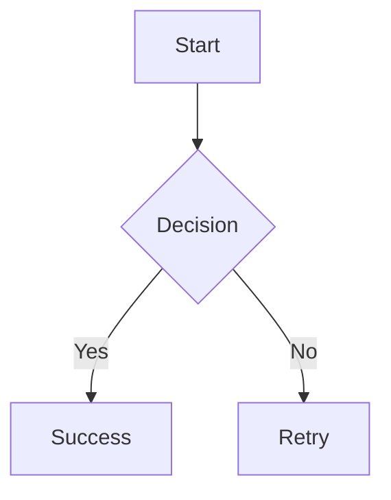

# Claude Memory - Astro Mermaid Integration

## Project Overview
Created a complete astro-mermaid integration for rendering Mermaid diagrams in Astro projects with automatic theme switching and client-side rendering.

## Project Structure
```
/Users/josesebastian/git/astro-mermaid/
├── astro-mermaid-integration.js     # Main integration file
├── astro-mermaid-integration.d.ts   # TypeScript definitions
├── package.json                     # Package configuration
├── README.md                        # Documentation
├── .npmrc                          # NPM authentication
├── .gitignore                      # Git ignore rules
└── starlight-demo/                 # Working demo with Starlight
    ├── package.json
    ├── astro.config.mjs
    ├── tsconfig.json
    └── src/
        ├── content/
        │   ├── config.ts
        │   └── docs/
        │       ├── index.mdx
        │       ├── installation.md
        │       ├── configuration.md
        │       └── examples/
        │           ├── flowcharts.md
        │           ├── sequence.md
        │           └── gantt.md
        ├── styles/
        │   └── custom.css
        └── env.d.ts
```

## Key Technical Implementation

### Integration Features
- Rehype plugin transforms ```mermaid code blocks to <pre class="mermaid">
- Client-side rendering with mermaid.js
- Automatic theme switching based on data-theme attribute
- Built-in responsive CSS styling
- TypeScript support with full type definitions

### Critical Setup Order
**IMPORTANT**: The mermaid integration MUST be placed BEFORE Starlight in the integrations array for the rehype plugin to work correctly:

```js
// astro.config.mjs
export default defineConfig({
  integrations: [
    mermaid({
      theme: "forest",
      autoTheme: true,
      mermaidConfig: {
        flowchart: { curve: "basis" }
      }
    }),
    starlight({ /* config */ })  // AFTER mermaid
  ]
});
```

### Configuration Options
```js
mermaid({
  theme: 'forest',              // 'default', 'dark', 'forest', 'neutral', 'base'
  autoTheme: true,              // Enable automatic theme switching
  mermaidConfig: {              // Additional mermaid configuration
    flowchart: { curve: 'basis' },
    startOnLoad: false
  }
})
```

### Built-in CSS Features
The integration includes comprehensive CSS out of the box:
- Responsive SVG sizing with max-width: 100%
- Flexbox centering with proper spacing (margin: 2rem 0)
- Smooth opacity transitions to prevent flash of unstyled content
- Theme-aware subtle backgrounds for light/dark modes
- Horizontal scrolling for large diagrams
- Rounded corners and padding for better visual presentation

### Client-Side Rendering Logic
- Detects data-theme changes for automatic theme switching
- Processes diagrams on DOM ready and after Astro view transitions
- Stores original diagram content in data-diagram attribute
- Generates unique IDs for each diagram (mermaid-{random})
- Includes comprehensive console logging for debugging

## NPM Package Details
- **Package Name**: astro-mermaid
- **Author**: Jose Sebastian
- **NPM Account**: joesaby
- **Repository**: https://github.com/joesaby/astro-mermaid
- **Auth Token**: Configured in .npmrc (not committed to version control)

### Dependencies
- **Peer Dependencies**: astro ^4.0.0 || ^5.0.0, mermaid ^10.0.0 || ^11.0.0
- **Runtime Dependencies**: mdast-util-to-string ^4.0.0, unist-util-visit ^5.0.0
- **Dev Dependencies**: TypeScript, Astro, Mermaid for development

## Usage Example
After installation with `npm install astro-mermaid mermaid`:

```js
// astro.config.mjs
import mermaid from 'astro-mermaid';
export default defineConfig({
  integrations: [mermaid()]
});
```

Then in markdown files:
````markdown

````

## Working Demo
- Successfully running at http://localhost:4321 in starlight-demo
- All 7 mermaid diagrams render correctly
- Theme switching works automatically
- Integrates seamlessly with Starlight documentation

## Publishing Status
Ready for npm publish with:
- Complete TypeScript definitions
- Comprehensive documentation
- Working demo
- Proper .gitignore excluding sensitive files
- Authentication configured for joesaby npm account

The integration provides a zero-configuration solution for beautiful mermaid diagrams in Astro projects.