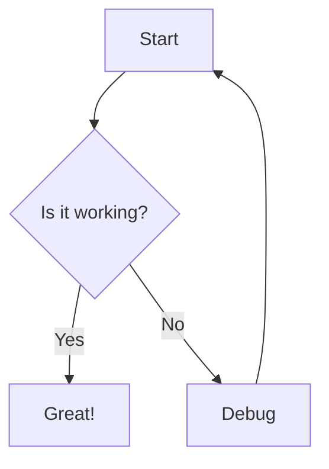

# astro-mermaid

An Astro integration for rendering Mermaid diagrams with automatic theme switching and client-side rendering.

## Features

- 🎨 Automatic theme switching based on your site's theme
- 🚀 Client-side rendering for optimal performance
- 📝 Simple markdown syntax using code blocks
- ⚡ Vite optimization for fast development
- 🔧 Customizable mermaid configuration
- 🎯 TypeScript support

## Installation

```bash
npm install astro-mermaid mermaid
```

## Usage

Add the integration to your `astro.config.mjs`:

```js
import { defineConfig } from 'astro/config';
import mermaid from 'astro-mermaid';

export default defineConfig({
  integrations: [
    mermaid({
      theme: 'forest'
    })
  ]
});
```

### Important: Integration Order

When using with Starlight or other integrations that process markdown, make sure to place the mermaid integration **before** them:

```js
import { defineConfig } from 'astro/config';
import starlight from '@astrojs/starlight';
import mermaid from 'astro-mermaid';

export default defineConfig({
  integrations: [
    mermaid(), // Must come BEFORE starlight
    starlight({
      title: 'My Docs'
    })
  ]
});
```

Then use mermaid code blocks in your markdown files:

````markdown

````

## Configuration

```js
mermaid({
  // Default theme: 'default', 'dark', 'forest', 'neutral', 'base'
  theme: 'forest',
  
  // Enable automatic theme switching based on data-theme attribute
  autoTheme: true,
  
  // Additional mermaid configuration
  mermaidConfig: {
    flowchart: {
      curve: 'basis'
    }
  }
})
```

## Theme Switching

If `autoTheme` is enabled (default), the integration will automatically switch between themes based on your site's `data-theme` attribute:

- `data-theme="light"` → uses 'default' mermaid theme
- `data-theme="dark"` → uses 'dark' mermaid theme

## Supported Diagrams

All mermaid diagram types are supported:

- Flowcharts
- Sequence diagrams
- Gantt charts
- Class diagrams
- State diagrams
- Entity Relationship diagrams
- User Journey diagrams
- Git graphs
- Pie charts
- Requirement diagrams
- C4 diagrams
- Mindmaps
- Timeline diagrams
- Quadrant charts
- And more!

## Demo

Check out the [live demo](https://astro-mermaid-demo.netlify.app/) built with Starlight.

## Contributing

Contributions are welcome! Please feel free to submit a Pull Request.

## License

MIT
