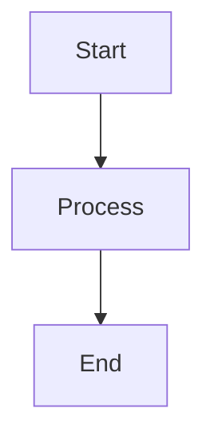

```mermaid
architecture-beta
  group api(logos:aws-lambda)[API]

  service db(logos:postgresql)[Database] in api
  service disk1(logos:aws-s3)[Storage] in api
  service disk2(logos:cloudflare)[CDN] in api
  service server(logos:docker)[Server] in api

  db:L -- R:server
  disk1:T -- B:server
  disk2:T -- B:db
```

# astro-mermaid

An Astro integration for rendering Mermaid diagrams with automatic theme switching, client-side rendering, and universal compatibility. Works seamlessly with both standalone Astro projects and documentation frameworks like Starlight.

## Live Demos

| Demo Type | URL | Description |
|-----------|-----|-------------|
| **Starlight Integration** | [starlight-mermaid-demo.netlify.app](https://starlight-mermaid-demo.netlify.app/) | Full documentation site with Starlight |
| **Standalone Template** | [astro-mermaid-demo.netlify.app](https://astro-mermaid-demo.netlify.app/) | Pure Astro project template |

Both demos showcase:
- ✅ All diagram types with live examples
- ✅ Theme switching (light/dark modes)  
- ✅ Icon pack integration
- ✅ Responsive design
- ✅ Content collections and direct `.astro` usage


## Features

- 🎨 **Universal Theme Detection** - Works with both `html[data-theme]` and `body[data-theme]` attributes
- 🚀 **Dual Plugin System** - Remark + Rehype plugins for comprehensive markdown processing  
- 📝 **Universal File Support** - Works with `.md`, `.mdx`, and `.astro` files
- ⚡ **Performance Optimized** - Conditional loading and client-side rendering
- 🔧 **Highly Configurable** - Full mermaid.js configuration support
- 🎯 **TypeScript Ready** - Complete type definitions included
- 🔒 **Privacy-Focused** - No external dependencies, fully offline-capable
- 📦 **Zero Configuration** - Works out of the box with sensible defaults
- 🎭 **Smooth UX** - Loading animations and layout shift prevention
- 🦌 **ELK Support** - Optionally works with the `elk` layout ([The Eclipse Layout Kernel](https://eclipse.dev/elk/))

## Quick Start

### 1. Installation

```bash
npm install astro-mermaid mermaid
```

### 2. Add to Astro Config

```js
// astro.config.mjs
import { defineConfig } from 'astro/config';
import mermaid from 'astro-mermaid';

export default defineConfig({
  integrations: [
    mermaid({
      theme: 'forest',
      autoTheme: true
    })
  ]
});
```

### 3. Use in Markdown

````markdown

````

### 4. (Optional) Use ELK layout

To enable the `elk` layout in Mermaid diagrams, install the `@mermaid-js/layout-elk` package.

```bash
npm install @mermaid-js/layout-elk
```

Learn more about [Mermaid layouts](https://mermaid.js.org/config/layouts.html) or [The Eclipse Layout Kernel](https://eclipse.dev/elk/).

## Integration Order (Important!)

When using with Starlight or other markdown-processing integrations, place mermaid **first**:

```js
import { defineConfig } from 'astro/config';
import starlight from '@astrojs/starlight';
import mermaid from 'astro-mermaid';

export default defineConfig({
  integrations: [
    mermaid(), // ⚠️ Must come BEFORE starlight
    starlight({
      title: 'My Docs'
    })
  ]
});
```

## Configuration

```js
mermaid({
  // Default theme: 'default', 'dark', 'forest', 'neutral', 'base'
  theme: 'forest',
  
  // Enable automatic theme switching based on data-theme attribute
  autoTheme: true,
  
  // Additional mermaid configuration
  mermaidConfig: {
    flowchart: {
      curve: 'basis'
    }
  },
  
  // Register icon packs for use in diagrams
  iconPacks: [
    {
      name: 'logos',
      loader: () => fetch('https://unpkg.com/@iconify-json/logos@1/icons.json').then(res => res.json())
    },
    {
      name: 'iconoir',
      loader: () => fetch('https://unpkg.com/@iconify-json/iconoir@1/icons.json').then(res => res.json())
    }
  ]
})
```

## Icon Packs

You can register icon packs to use custom icons in your diagrams. Icon packs are loaded from Iconify JSON sources:

```js
iconPacks: [
  {
    name: 'logos',
    loader: () => fetch('https://unpkg.com/@iconify-json/logos@1/icons.json').then(res => res.json())
  }
]
```

Then use icons in your diagrams:

````markdown

````

## Theme Switching

If `autoTheme` is enabled (default), the integration will automatically switch between themes based on your site's `data-theme` attribute:

- `data-theme="light"` → uses 'default' mermaid theme
- `data-theme="dark"` → uses 'dark' mermaid theme

## Client-Side Rendering & Security

### 🔒 Privacy & Security Benefits

This integration uses **100% client-side rendering** with zero external dependencies at runtime:

- **No Data Transmission**: Your diagram content never leaves your browser
- **No External Servers**: No calls to mermaid.live or any external services
- **Offline Capable**: Works completely offline after initial page load
- **Zero Network Latency**: Instant diagram rendering without network delays
- **Corporate Firewall Friendly**: No external domains need to be whitelisted

### ⚡ How It Works

1. **Build Time**: Mermaid code blocks are transformed to `<pre class="mermaid">` elements
2. **Runtime**: The bundled Mermaid JavaScript library renders diagrams locally
3. **Output**: Pure SVG generated entirely in your browser

```javascript
// All rendering happens locally - no network calls
import mermaid from 'mermaid';
const { svg } = await mermaid.render(id, diagramDefinition);
```

### 🛡️ Enterprise & Compliance

Perfect for:
- Corporate environments with strict security policies
- GDPR/privacy-compliant applications  
- Air-gapped or restricted network environments
- Applications requiring data sovereignty
- High-security environments where external requests are prohibited

## Supported Diagrams

All mermaid diagram types are supported:

- Flowcharts
- Sequence diagrams
- Gantt charts
- Class diagrams
- State diagrams
- Entity Relationship diagrams
- User Journey diagrams
- Git graphs
- Pie charts
- Requirement diagrams
- C4 diagrams
- Mindmaps
- Timeline diagrams
- Quadrant charts
- And more!

## Version

**Current:** `v1.2.0` - Enhanced universal compatibility with dual plugin system

See [changelog](https://github.com/joesaby/astro-mermaid/releases) for version history.

## Contributing

Contributions welcome! See our [demos](https://astro-mermaid-demo.netlify.app/) for examples.

## License

MIT © [Jose Sebastian](https://github.com/joesaby)
