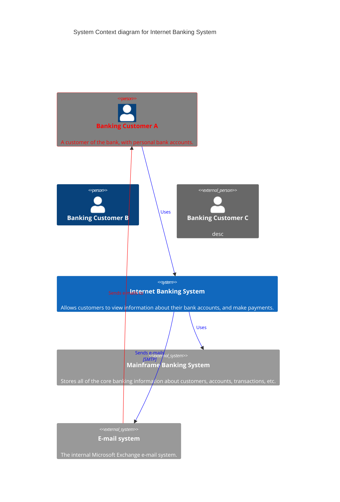
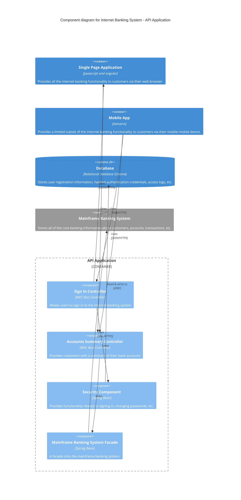
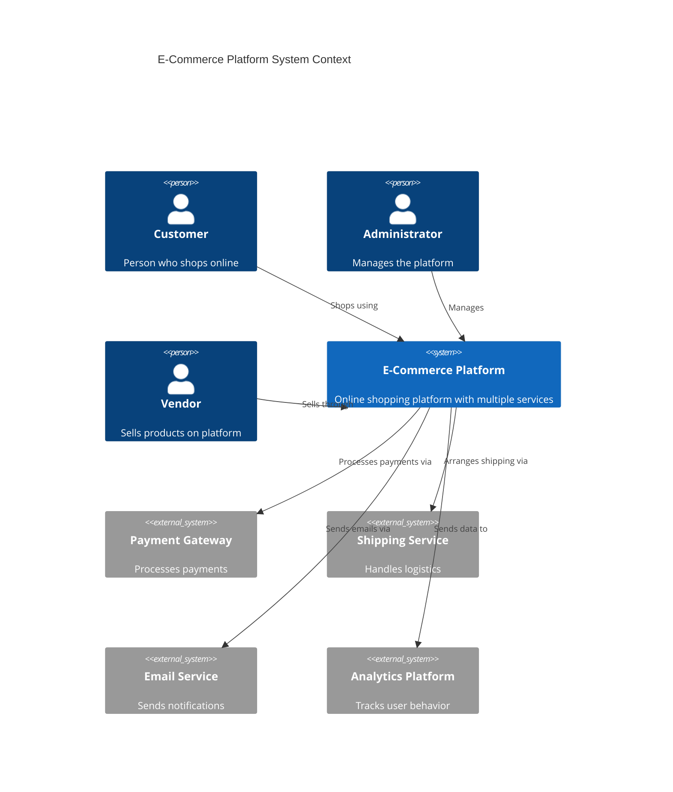
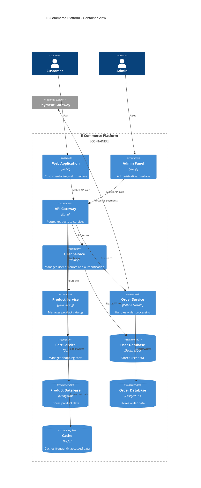

C4 diagrams provide a way to describe and communicate software architecture at different levels of detail.

## System Context Diagram



## Container Diagram

```mermaid
C4Container
    title Container diagram for Internet Banking System

    System_Ext(email_system, "E-Mail System", "The internal Microsoft Exchange system", $tags="v1.0")
    Person(customer, "Customer", "A customer of the bank, with personal bank accounts")

    Container_Boundary(c1, "Internet Banking") {
        Container(web_app, "Web Application", "Java, Spring MVC", "Delivers the static content and the Internet banking SPA")
        Container(spa, "Single-Page App", "JavaScript, Angular", "Provides all the Internet banking functionality to customers via their web browser")
        Container(mobile_app, "Mobile App", "C#, Xamarin", "Provides a limited subset of the Internet banking functionality to customers via their mobile device")
        Container(api, "API Application", "Java, Spring Boot", "Provides Internet banking functionality via JSON/HTTPS API")
        ContainerDb(database, "Database", "SQL Database", "Stores user registration information, hashed auth credentials, access logs, etc.")
    }

    System_Ext(banking_system, "Mainframe Banking System", "Stores all of the core banking information about customers, accounts, transactions, etc.")

    Rel(customer, web_app, "Uses", "HTTPS")
    UpdateRelStyle(customer, web_app, $offsetX="50")
    Rel(customer, spa, "Uses", "HTTPS")
    UpdateRelStyle(customer, spa, $offsetX="50")
    Rel(customer, mobile_app, "Uses")
    UpdateRelStyle(customer, mobile_app, $offsetY="15")

    Rel_Back(web_app, spa, "Delivers")
    UpdateRelStyle(web_app, spa, $offsetY="15")

    Rel(spa, api, "Uses", "JSON/HTTPS")
    Rel(mobile_app, api, "Uses", "JSON/HTTPS")
    Rel_Back_Neighbor(database, api, "Reads from and writes to", "SQL")

    Rel(api, banking_system, "Uses", "XML/HTTPS")
    Rel(api, email_system, "Sends e-mail using", "SMTP")

    UpdateLayoutConfig($c4ShapeInRow="2", $c4BoundaryInRow="1")
```

## Component Diagram



## Microservices System Context



## Microservices Container View

