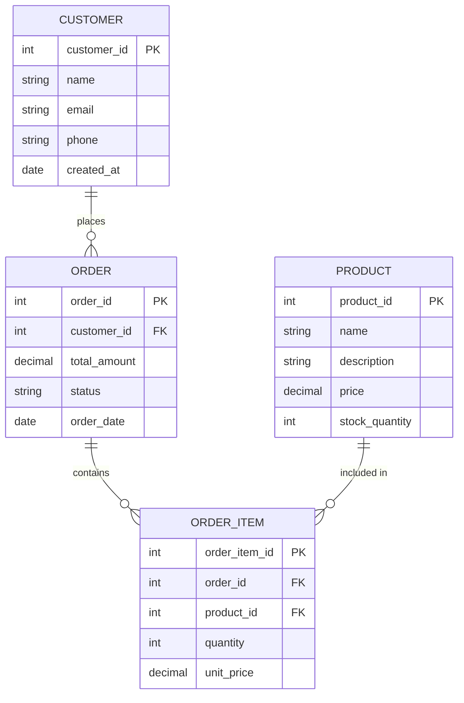
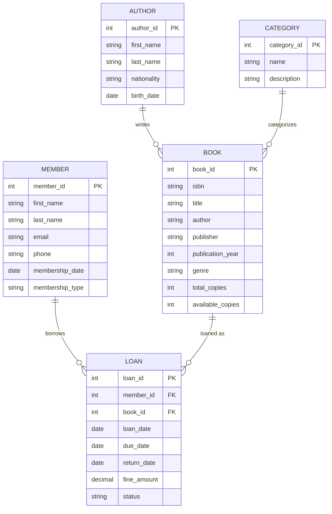
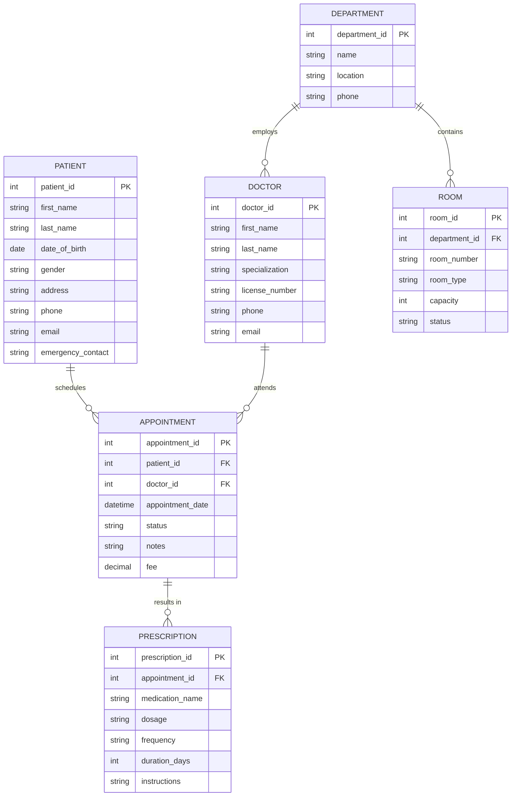
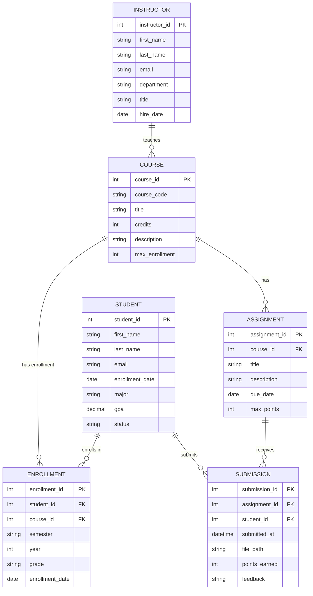

Entity Relationship diagrams show the relationships between entities in a database.

## Simple E-Commerce Database

## Library Management System

## Hospital Management System

## University Database

