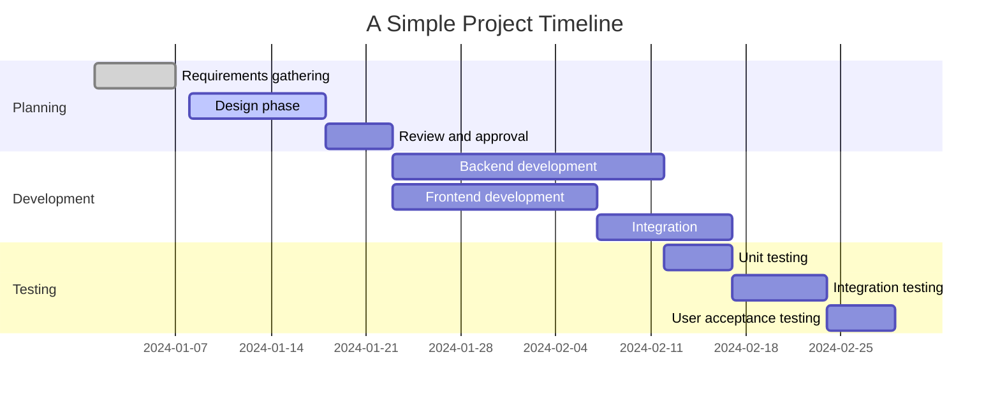
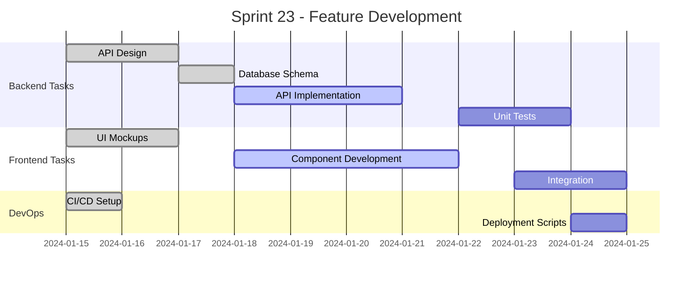

## Project Timeline

```mermaid
gantt
    title A Simple Project Timeline
    dateFormat  YYYY-MM-DD
    section Planning
    Requirements gathering    :done,    des1, 2024-01-01, 2024-01-07
    Design phase             :active,  des2, 2024-01-08, 10d
    Review and approval      :         des3, after des2, 5d
    
    section Development
    Backend development      :         dev1, after des3, 20d
    Frontend development     :         dev2, after des3, 15d
    Integration             :         dev3, after dev2, 10d
    
    section Testing
    Unit testing            :         test1, after dev1, 5d
    Integration testing     :         test2, after dev3, 7d
    User acceptance testing :         test3, after test2, 5d
```

## Development Sprint

```mermaid
gantt
    title Sprint 23 - Feature Development
    dateFormat  YYYY-MM-DD
    
    section Backend Tasks
    API Design              :done,    2024-01-15, 2d
    Database Schema         :done,    2024-01-17, 1d
    API Implementation      :active,  2024-01-18, 3d
    Unit Tests             :         2024-01-22, 2d
    
    section Frontend Tasks
    UI Mockups             :done,    2024-01-15, 2d
    Component Development   :active,  2024-01-18, 4d
    Integration            :         2024-01-23, 2d
    
    section DevOps
    CI/CD Setup            :done,    2024-01-15, 1d
    Deployment Scripts     :         2024-01-24, 1d
```