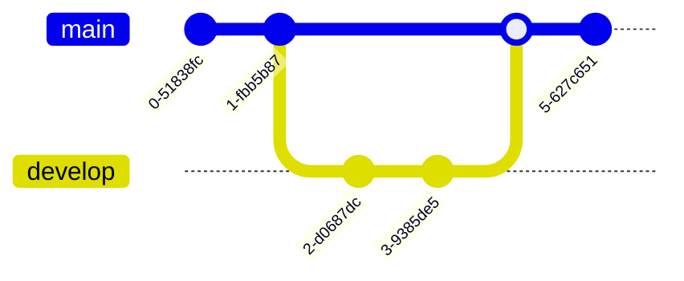
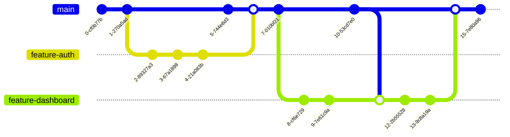
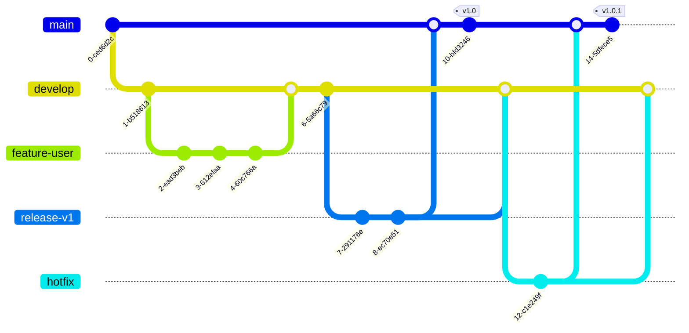
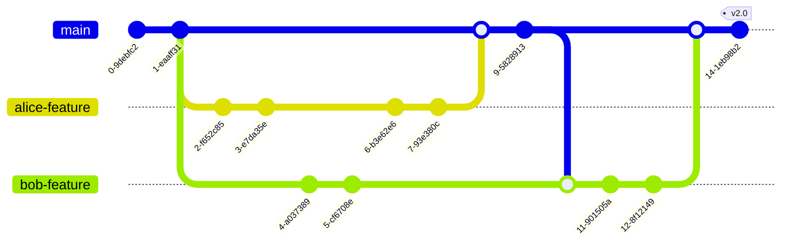
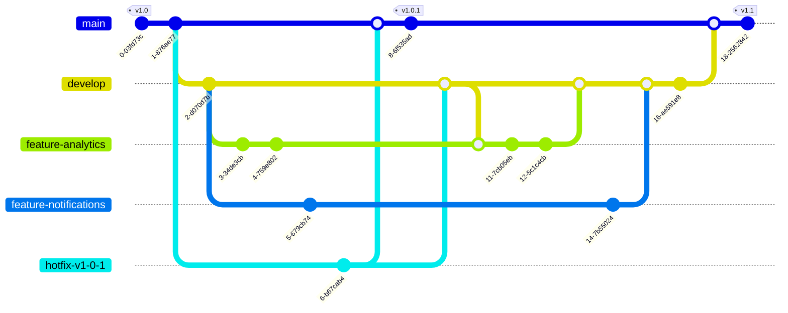
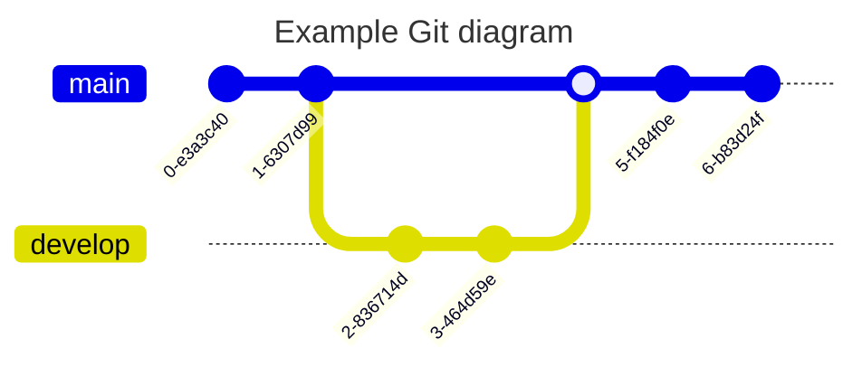

Git graphs visualize the branching and merging in a Git repository.

## Basic Git Flow

## Feature Branch Workflow

## Gitflow Workflow

## Collaborative Development

## Release and Hotfix Flow

## Simple Example with Title

