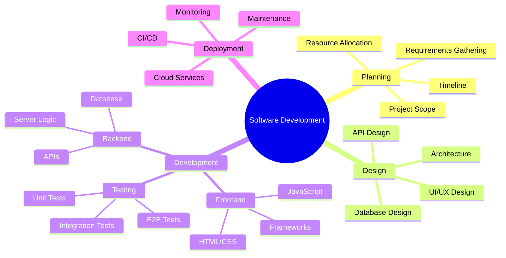
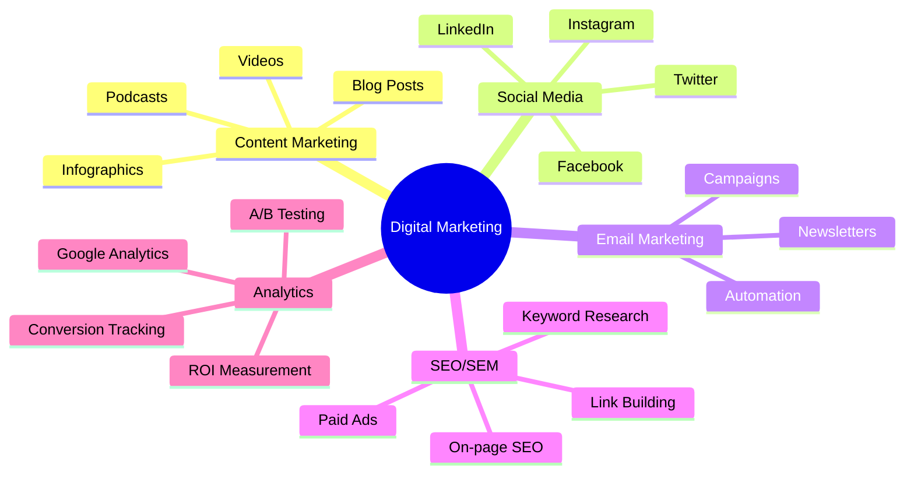
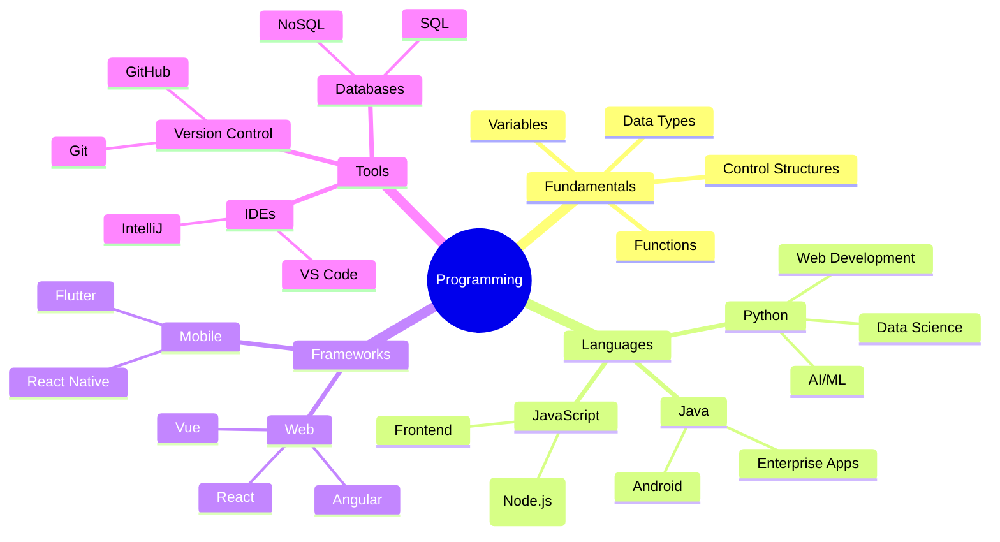
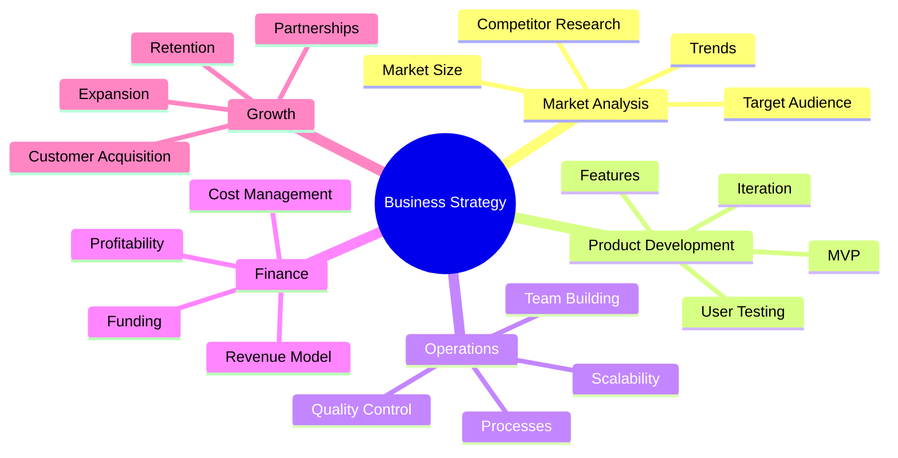
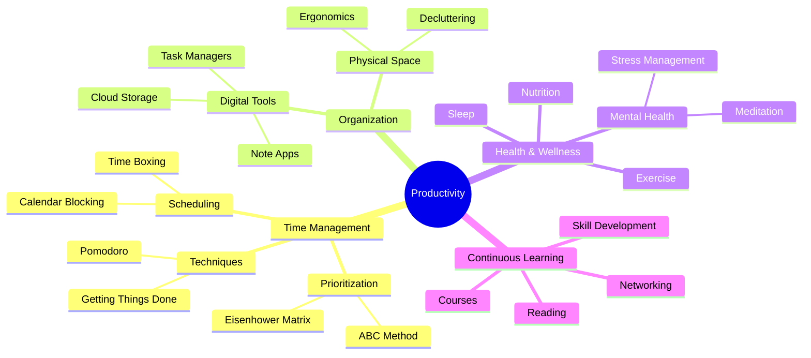
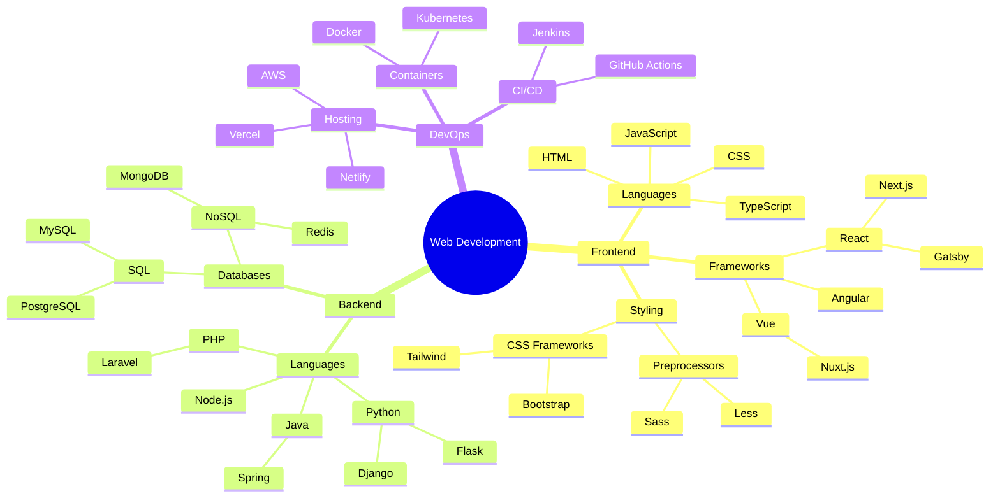

Mindmaps are visual representations of information that show relationships between concepts.

## Software Development Process

## Digital Marketing Strategy

## Learning Programming

## Business Strategy

## Personal Productivity

## Web Development Technologies

