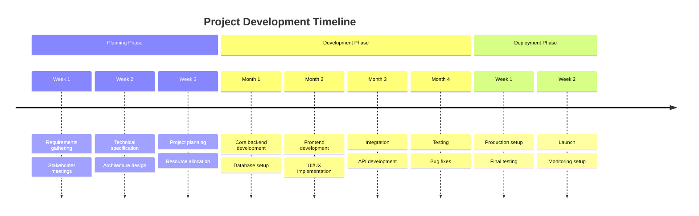
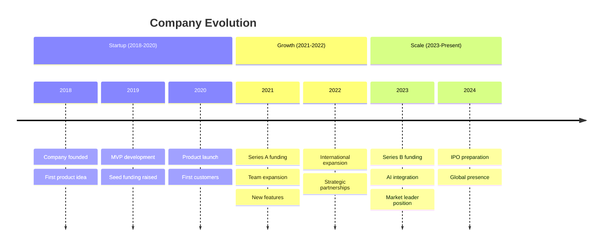
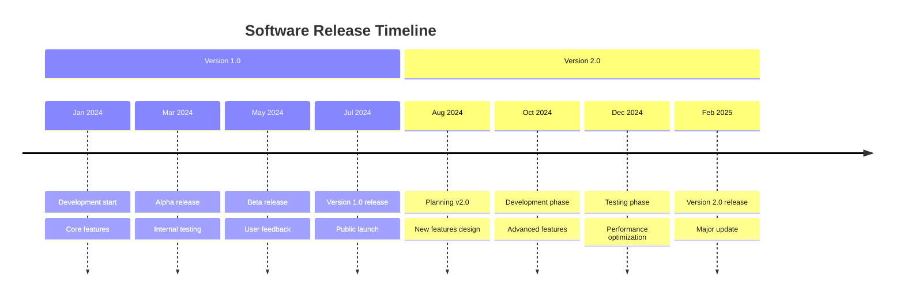
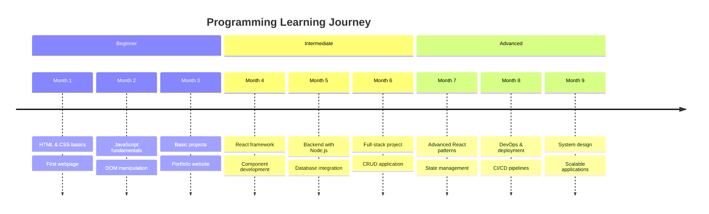
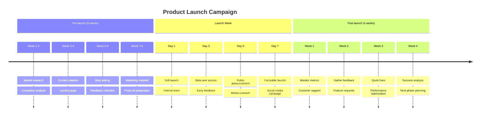
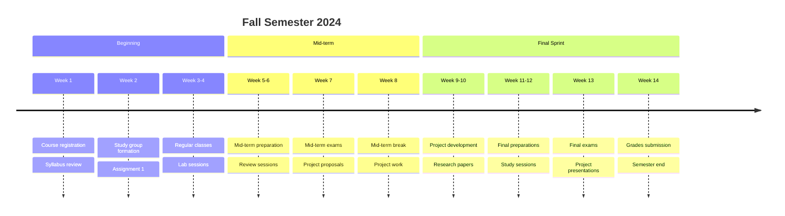

Timeline diagrams show events in chronological order.

## Project Development Timeline

## Company History

## Software Release Cycle

## Learning Journey

## Product Launch Campaign

## Academic Semester

