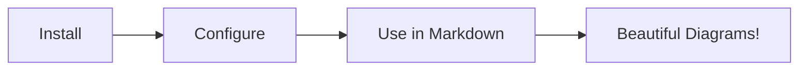

## Installation

Install the required packages:

```bash
npm install astro-mermaid mermaid
```

Or with other package managers:

```bash
# yarn
yarn add astro-mermaid mermaid

# pnpm
pnpm add astro-mermaid mermaid
```

## Basic Setup

Add the integration to your `astro.config.mjs`:

```js
import { defineConfig } from 'astro/config';
import mermaid from 'astro-mermaid';

export default defineConfig({
  integrations: [
    mermaid()
  ]
});
```

## With Options

```js
import { defineConfig } from 'astro/config';
import mermaid from 'astro-mermaid';

export default defineConfig({
  integrations: [
    mermaid({
      theme: 'forest',
      autoTheme: true,
      mermaidConfig: {
        flowchart: {
          curve: 'basis'
        }
      }
    })
  ]
});
```

## Usage in Markdown

Once installed, you can use mermaid code blocks in your markdown files:

````markdown

````

Which renders as:


## TypeScript Support

The integration includes TypeScript definitions. Your editor should provide autocomplete for configuration options:

```ts
import mermaid from 'astro-mermaid';
// Full TypeScript support for options
```