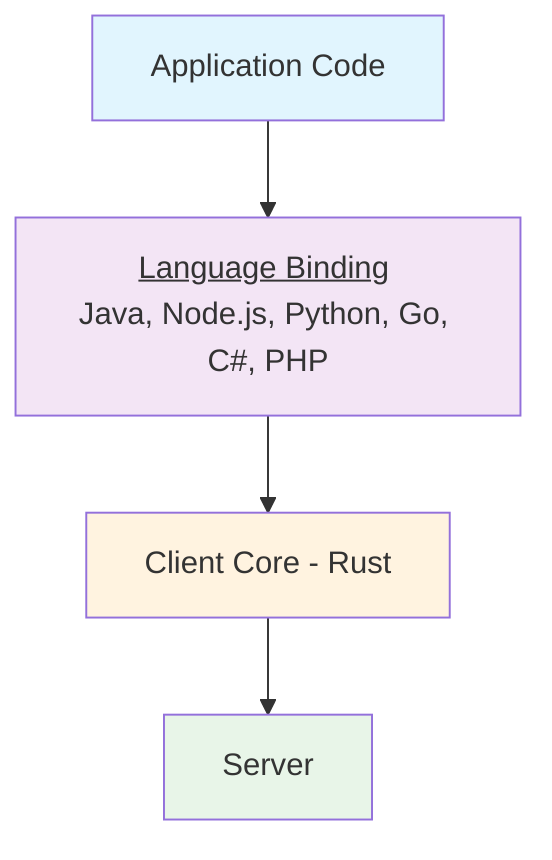
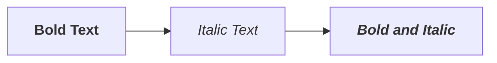
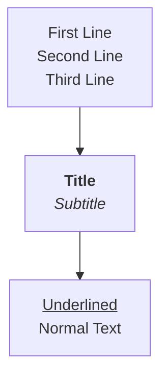
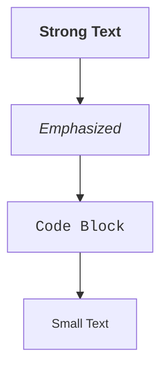

# HTML Markup in Mermaid Diagrams (Astro Demo)

Testing the reported issue #13 where HTML tags are stripped from mermaid diagrams in the pure Astro environment.

## Test Case from Issue #13

The following diagram should show an underlined "Language Binding" text with content on two lines:

## Additional Test Cases

### Bold and Italic Text

### Line Breaks and Formatting

### Complex HTML Elements

