# Icon Pack Test

This page tests the new iconPacks feature.

## Architecture Diagram with Icons

```mermaid
architecture-beta
  group api(logos:aws-lambda)[API]

  service db(logos:postgresql)[Database] in api
  service disk1(logos:aws-s3)[Storage] in api
  service disk2(logos:cloudflare)[CDN] in api
  service server(logos:docker)[Server] in api

  db:L -- R:server
  disk1:T -- B:server
  disk2:T -- B:db
```

## Architecture with Iconoir Icons

```mermaid
architecture-beta
  group host(iconoir:laptop)[Host]

  service client1(iconoir:app-window)[Client] in host
  service server1(iconoir:server)[Server]
  service tool1(iconoir:tools)[Tool]
  client1:B -- T:server1
  server1:B -- T:tool1
  
  service client2(iconoir:app-window)[Client] in host
  service server2(iconoir:server)[Server]
  service tool2(iconoir:tools)[Tool]
  service db2(iconoir:database)[RAG]
  client2:B -- T:server2
  server2:B -- T:tool2
  server2:R -- L:db2
```

## Inline Icon Data (no loader/URL)

This demonstrates passing icon data **directly** via the `icons` property instead of a `loader` function — the fix for [#18](https://github.com/joesaby/astro-mermaid/issues/18). The `test-icons` pack below is plain JSON registered inline in `astro.config.mjs`, so there is no network fetch and no function serialization. Reference it by the pack name: `test-icons:circle`.

```mermaid
architecture-beta
  group net(test-icons:circle)[Network]

  service alpha(test-icons:circle)[Alpha] in net
  service beta(test-icons:circle)[Beta] in net

  alpha:R -- L:beta
```

