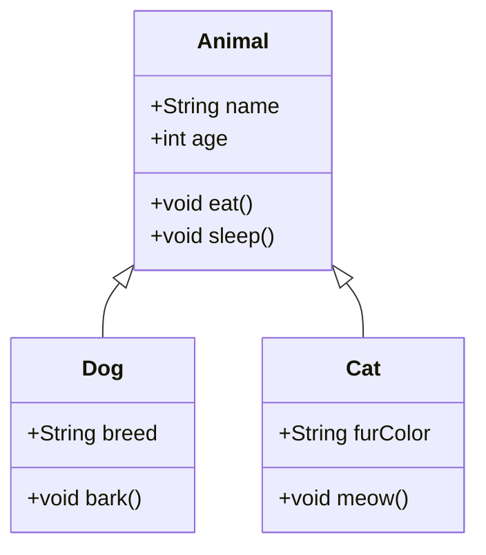
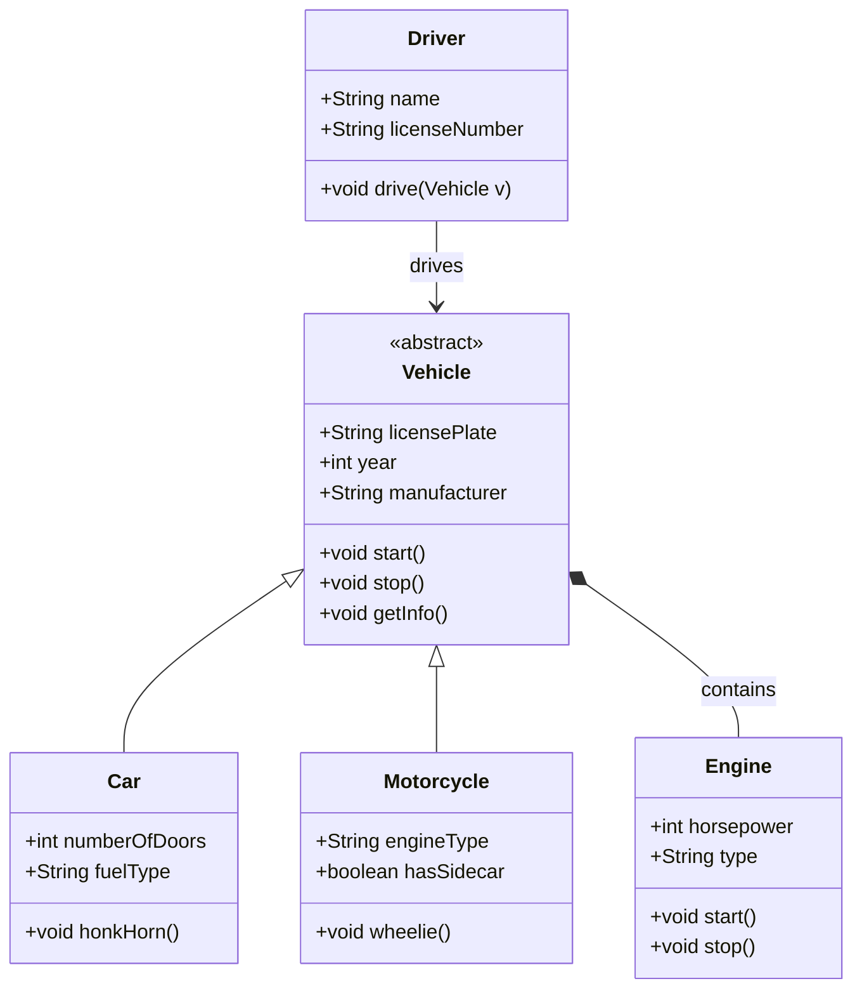
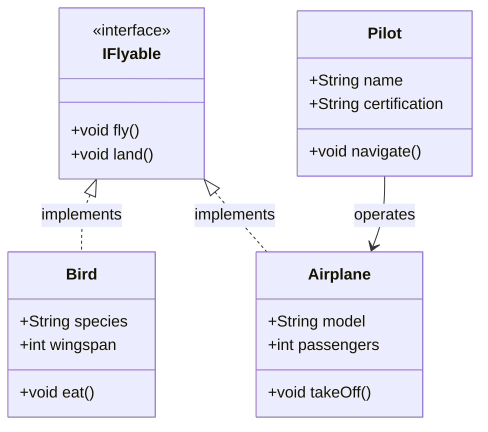

Class diagrams show the structure of a system by displaying classes, attributes, methods, and relationships.

## Basic Class Diagram



## Detailed Class Diagram



## Interface and Implementation



## Multiplicity and Relationships

```mermaid
classDiagram
    class University {
        +String name
        +String location
        +List~Department~ departments
    }
    
    class Department {
        +String name
        +String head
        +List~Course~ courses
    }
    
    class Course {
        +String code
        +String title
        +int credits
    }
    
    class Student {
        +String studentId
        +String name
        +List~Course~ enrolledCourses
    }
    
    class Professor {
        +String employeeId
        +String name
        +String specialization
    }
    
    University ||--o{ Department : "1 to many"
    Department ||--o{ Course : "1 to many"
    Professor ||--o{ Course : "teaches"
    Student }o--o{ Course : "enrolls in"
    
    note for University "Main campus location"
    note for Student "Undergraduate and Graduate students"
```