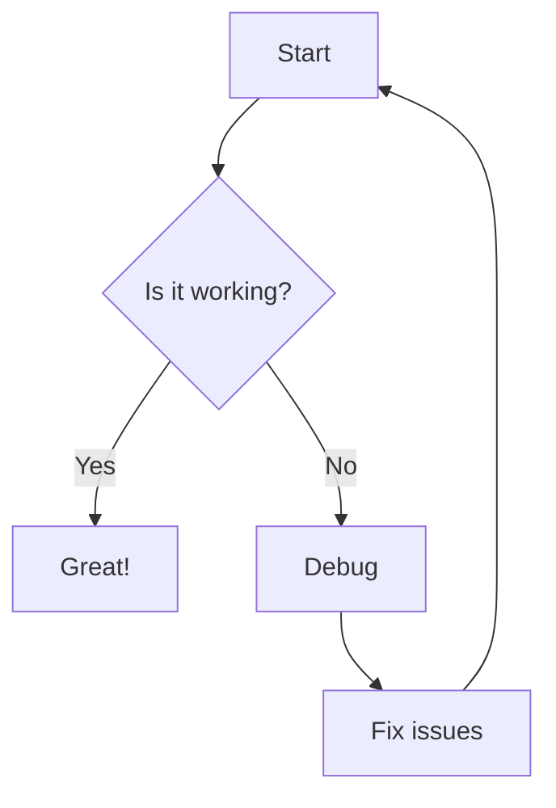
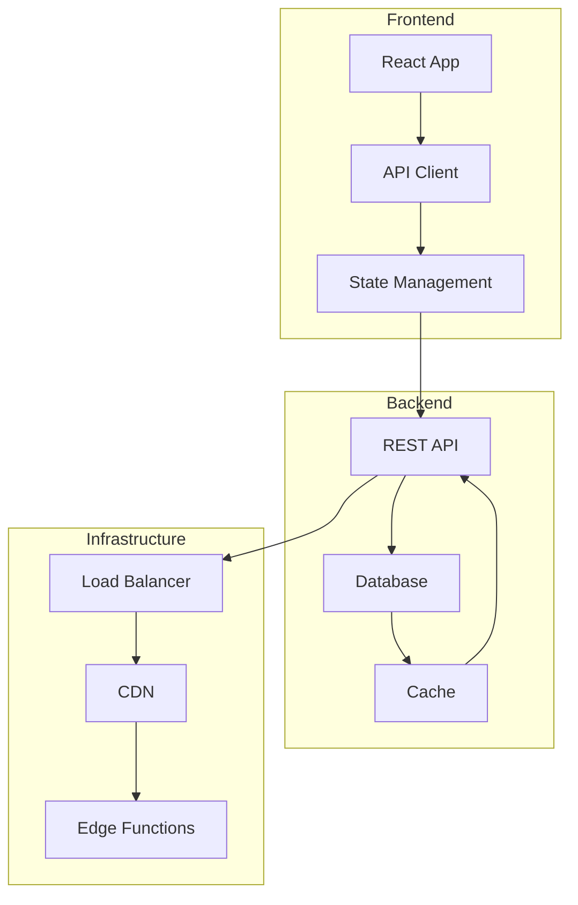
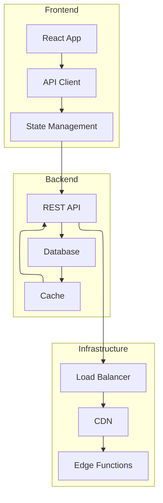
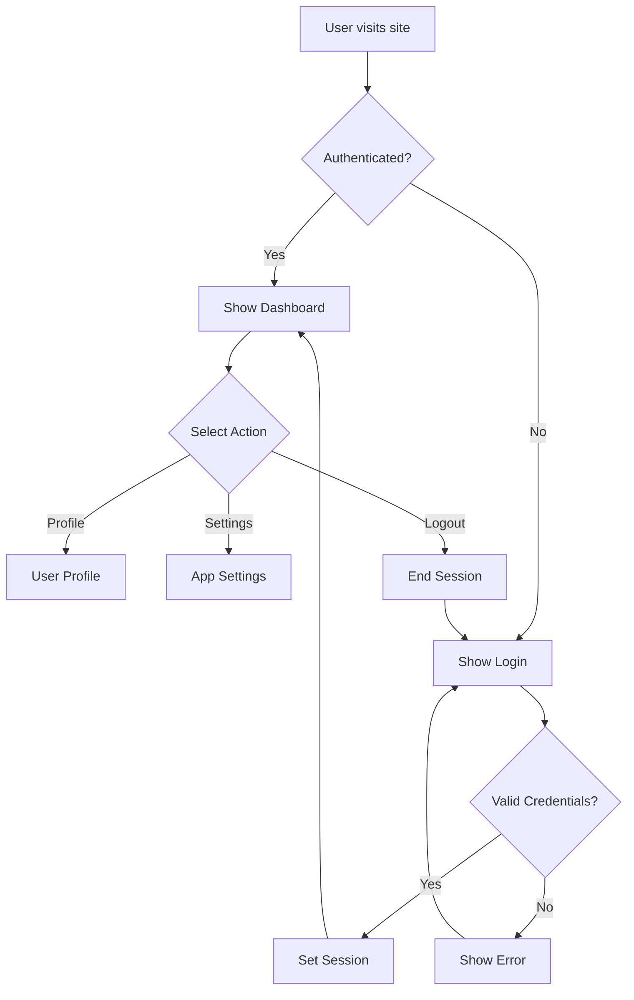
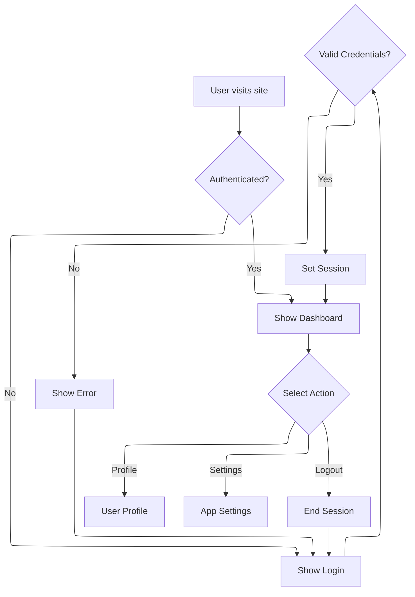
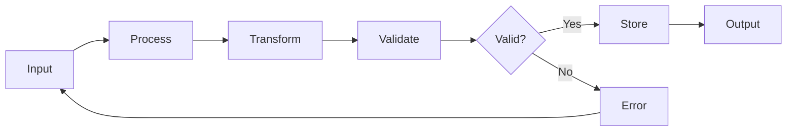
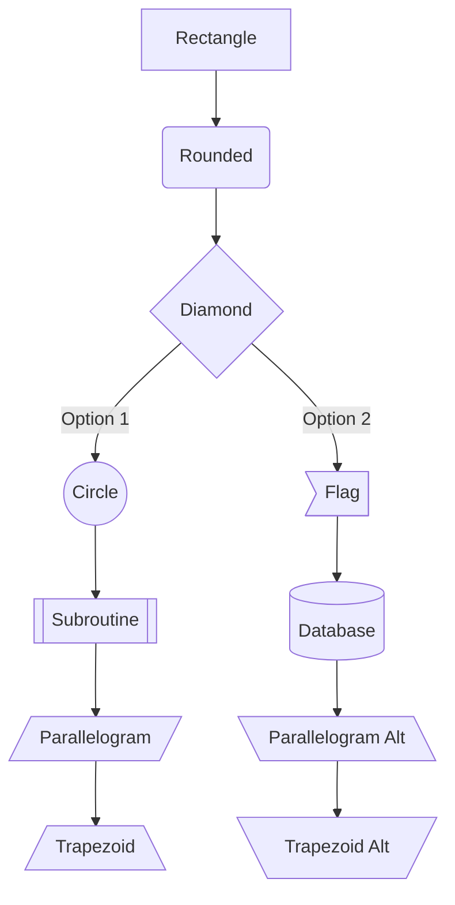
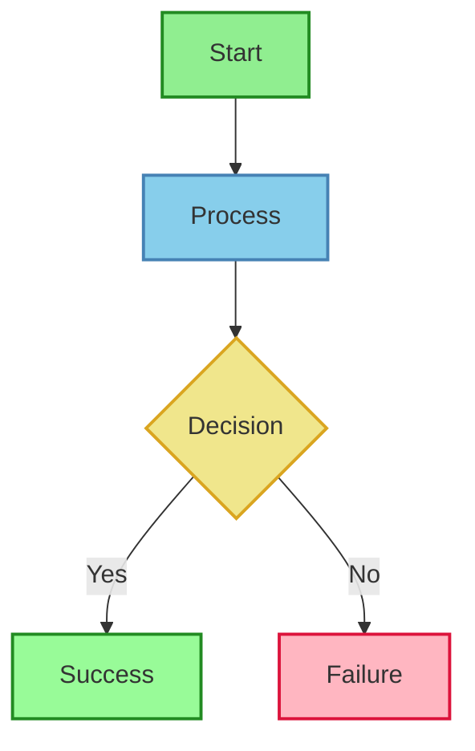
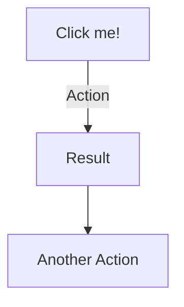

## Basic Flowchart

## Flowchart with Subgraphs

Decision Tree with ELK layout

## Decision Tree

Decision Tree with ELK layout

## Horizontal Flow

## Complex Node Shapes

## Styled Flowchart

## Interactive Elements

