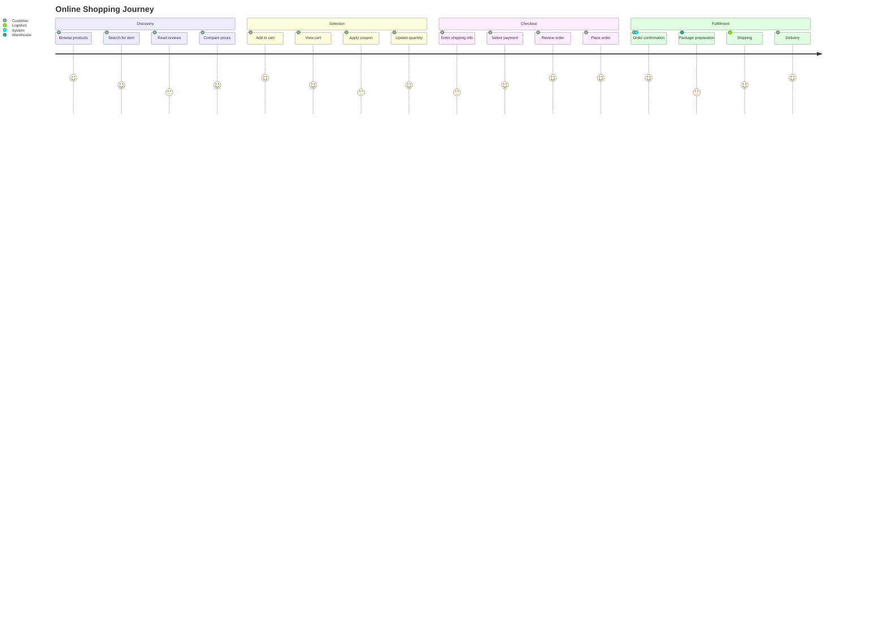
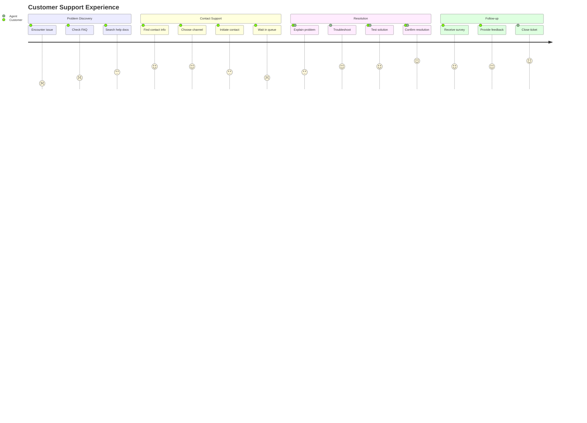
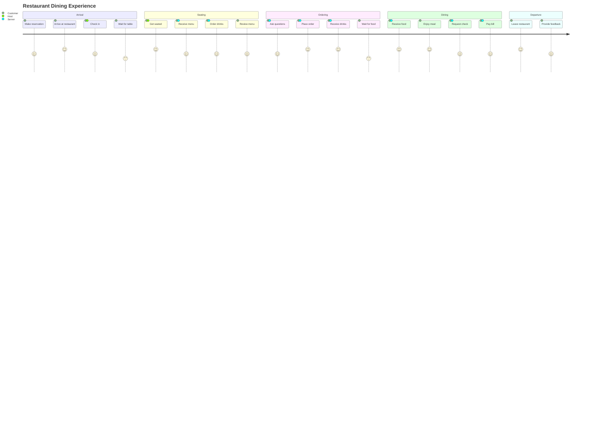
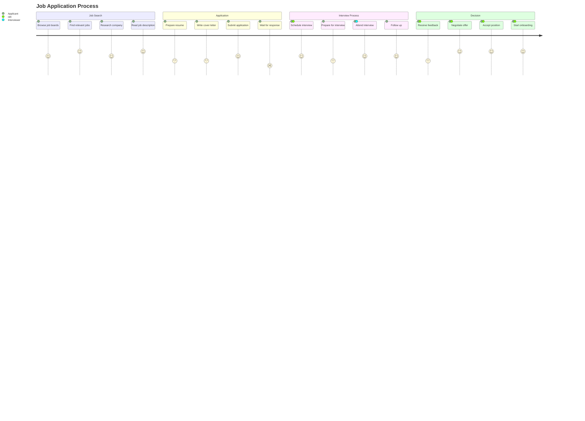
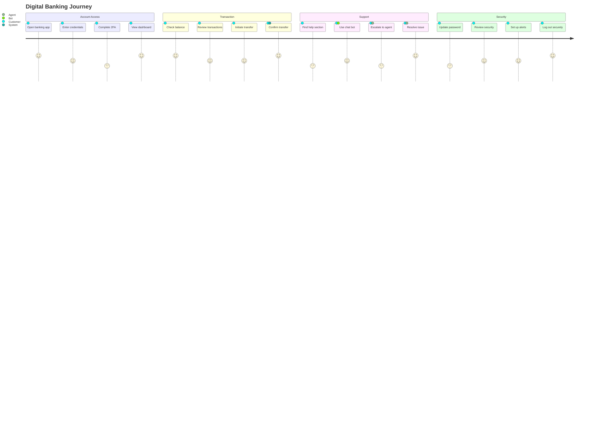

User journey diagrams map out the steps a user takes to complete a task or achieve a goal.

## E-commerce Purchase Journey

## Customer Support Journey

## Mobile App Onboarding

## Restaurant Dining Experience

## Job Application Process

## Banking Digital Experience

