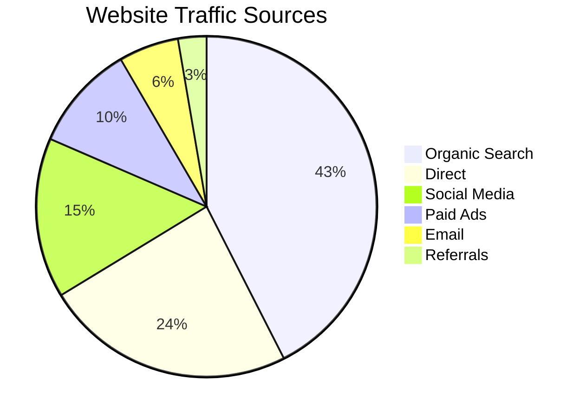
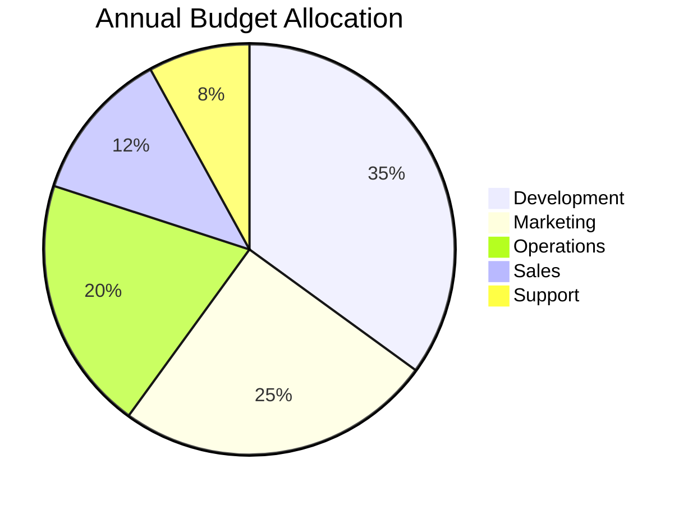
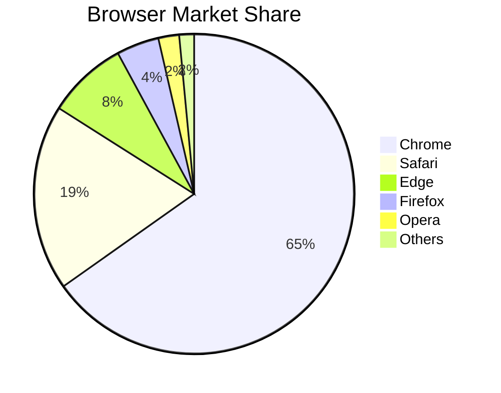
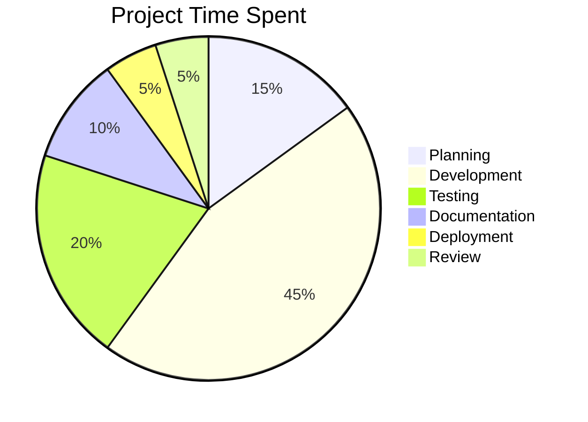
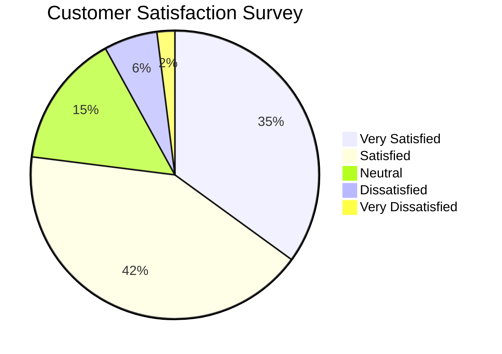
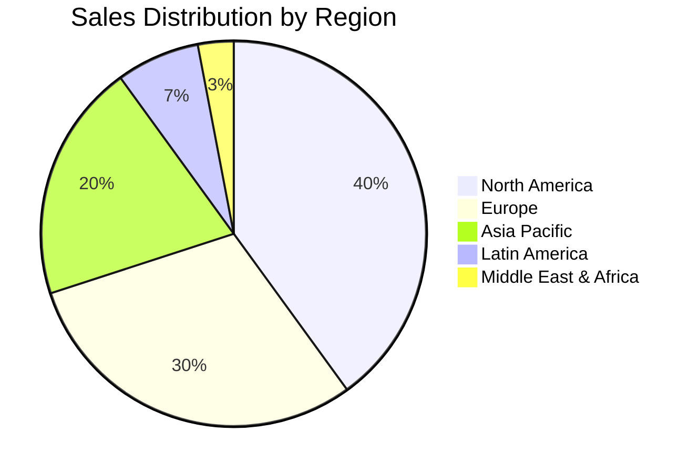
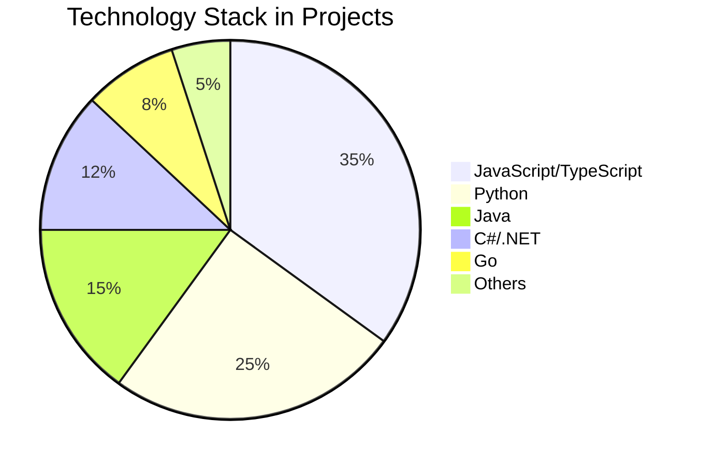
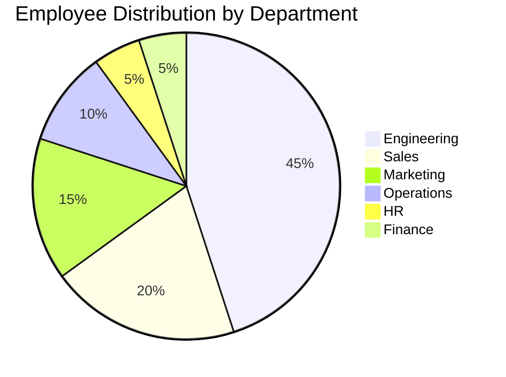
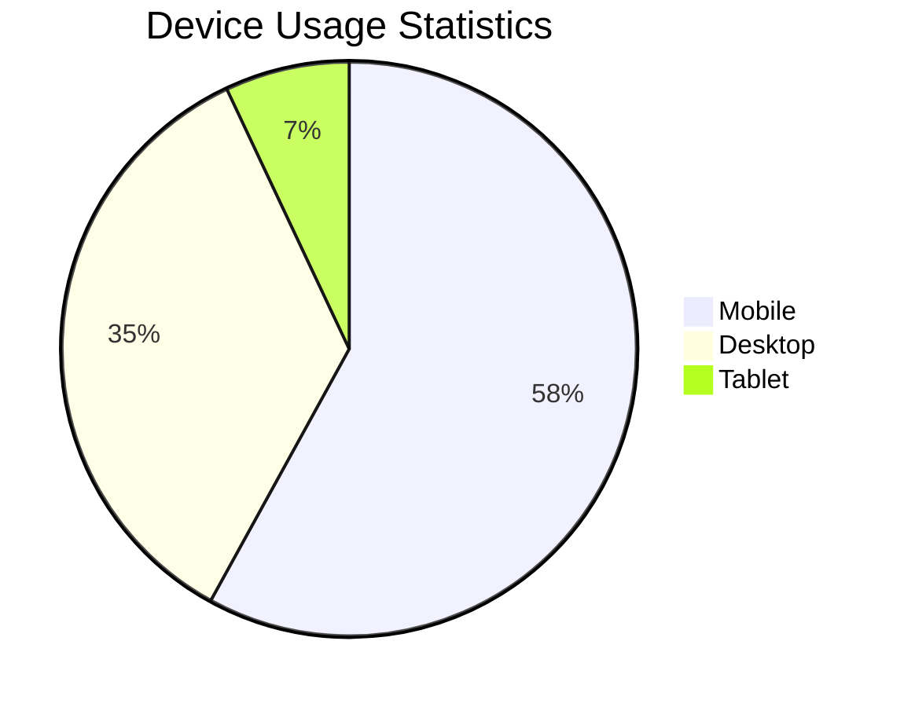
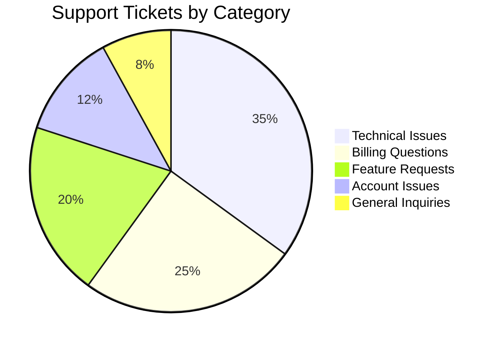

Pie charts show proportional data as slices of a circle.

## Website Traffic Sources

## Budget Allocation

## Browser Usage Statistics

## Project Time Distribution

## Customer Satisfaction

## Sales by Region

## Technology Stack Usage

## Employee Distribution

## Mobile vs Desktop Usage

## Support Ticket Categories

