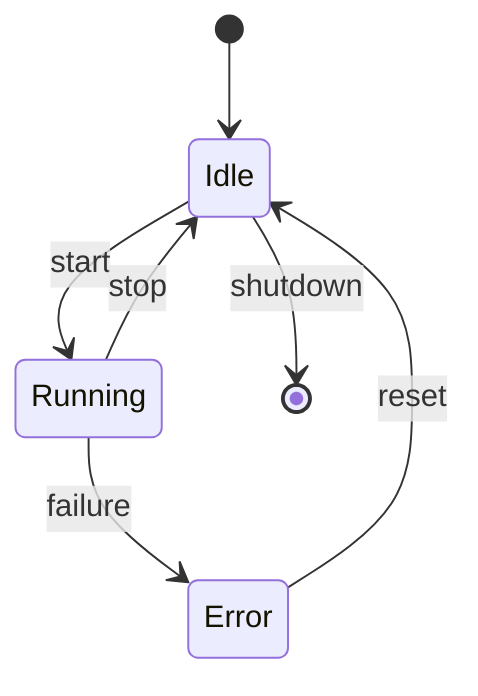
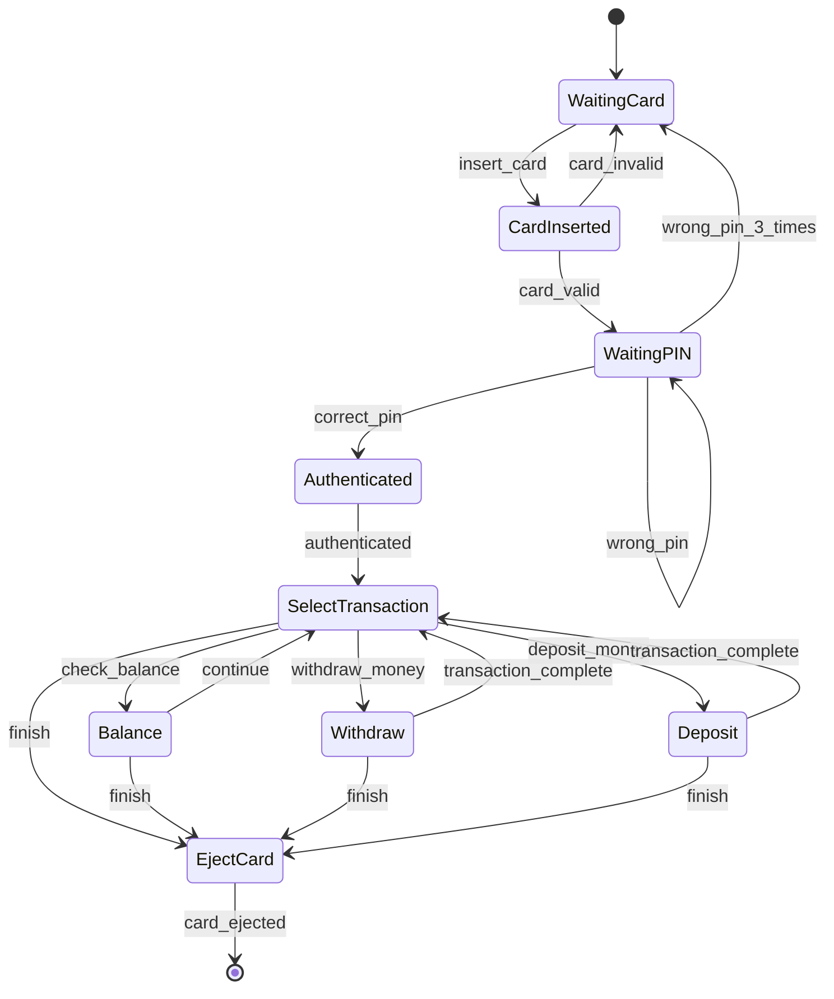
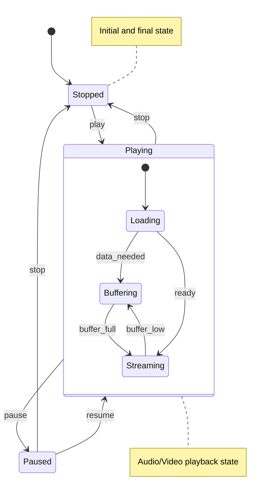
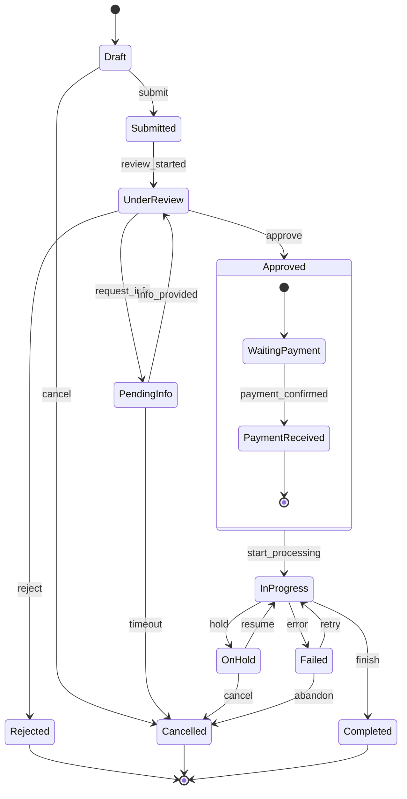
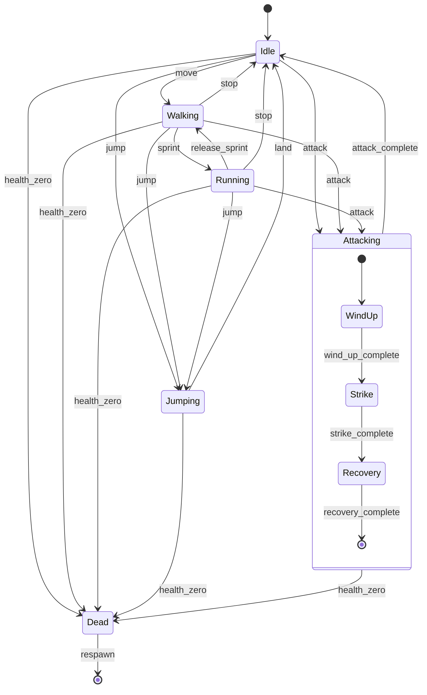
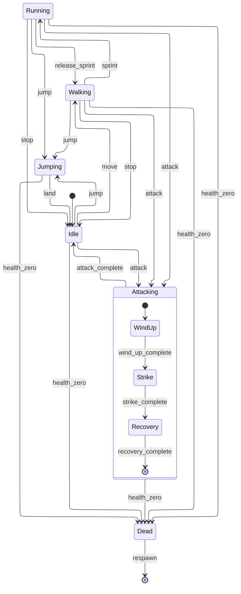

State diagrams show the different states of an object and transitions between them.

## Simple State Machine

## ATM State Machine

## Player State Machine

## Order Processing

## Game Character States

Game Character States with ELK layout

