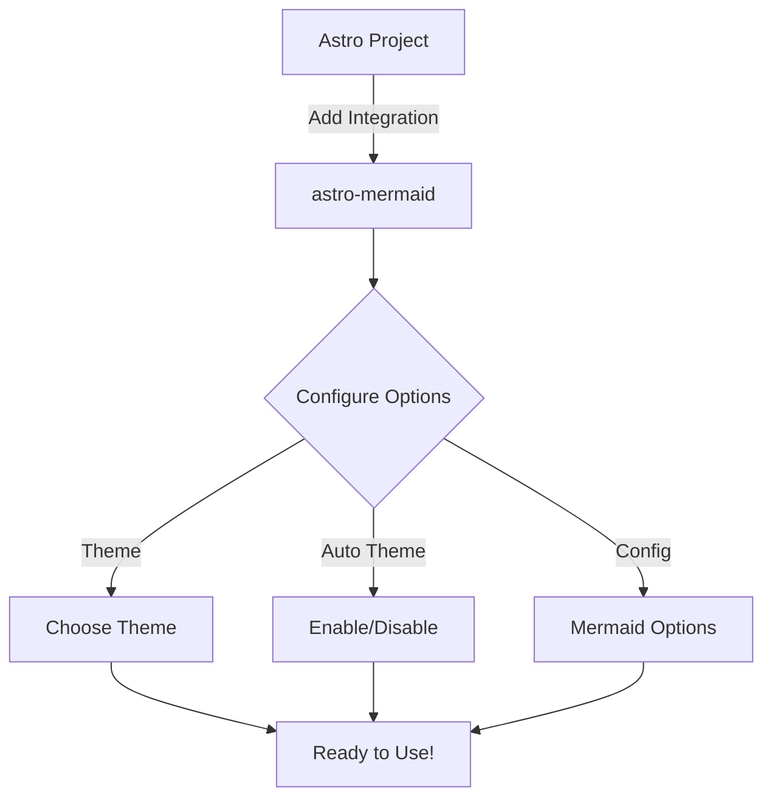
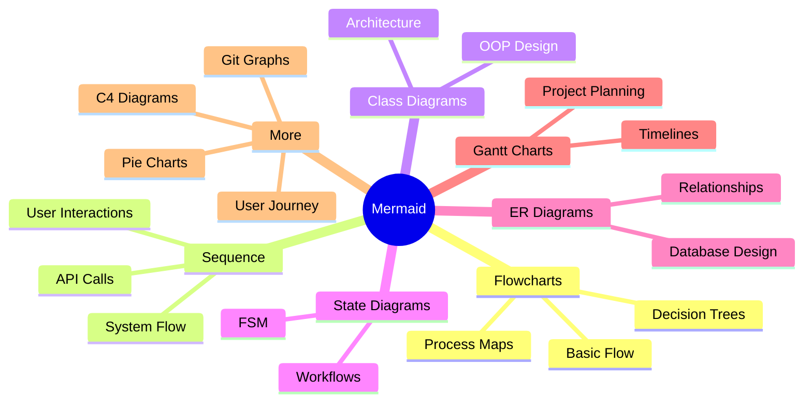

import { Card, CardGrid } from '@astrojs/starlight/components';

# Welcome to Astro Mermaid

Astro Mermaid is a powerful integration that brings the full capabilities of Mermaid.js to your Astro projects. With automatic theme switching and optimized client-side rendering, you can create beautiful diagrams that seamlessly integrate with your site's design.

## Quick Example

Here's a simple flowchart to get you started:

## Features

<CardGrid>
  <Card title="Easy Integration" icon="rocket">
    Simple installation and configuration with Astro's integration system
  </Card>
  <Card title="Theme Support" icon="palette">
    Automatic theme switching based on your site's theme
  </Card>
  <Card title="Full Mermaid Support" icon="document">
    All Mermaid diagram types are supported out of the box
  </Card>
  <Card title="Performance Optimized" icon="lightning">
    Client-side rendering with Vite optimization
  </Card>
</CardGrid>

## Supported Diagram Types

## Next Steps

- [Install the integration](/installation)
- [Configure options](/configuration)
- [Explore examples](/examples/flowcharts)