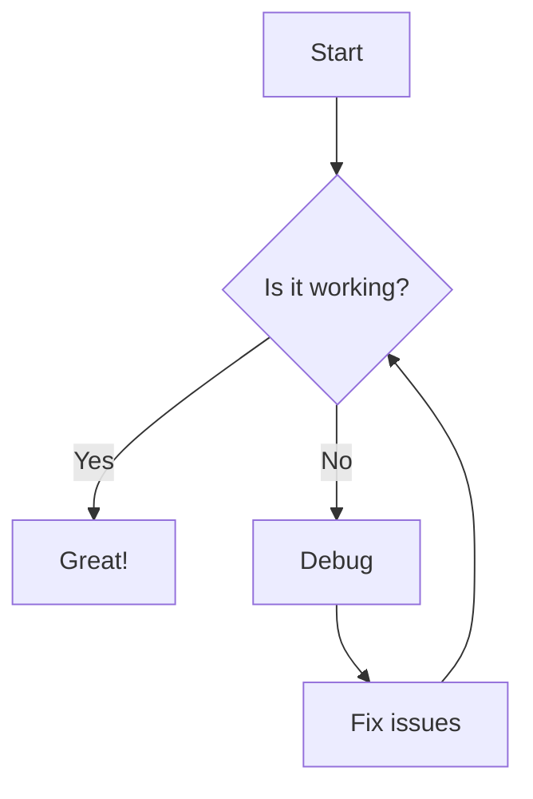
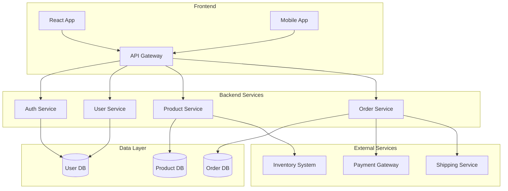

# Testing Mermaid Zoom

This page tests the zoom functionality with mermaid diagrams.

## Simple Flowchart

Click on the diagram below to zoom in:

## Regular Image (for comparison)

Here's a regular image to compare zoom behavior:

## Complex Diagram

A more complex diagram to test zoom on larger content:

## Notes

- If zoom is working, clicking on any mermaid diagram should open it in a zoom view
- The zoom functionality should work the same as regular images
- You should see a zoom icon when hovering over the diagrams